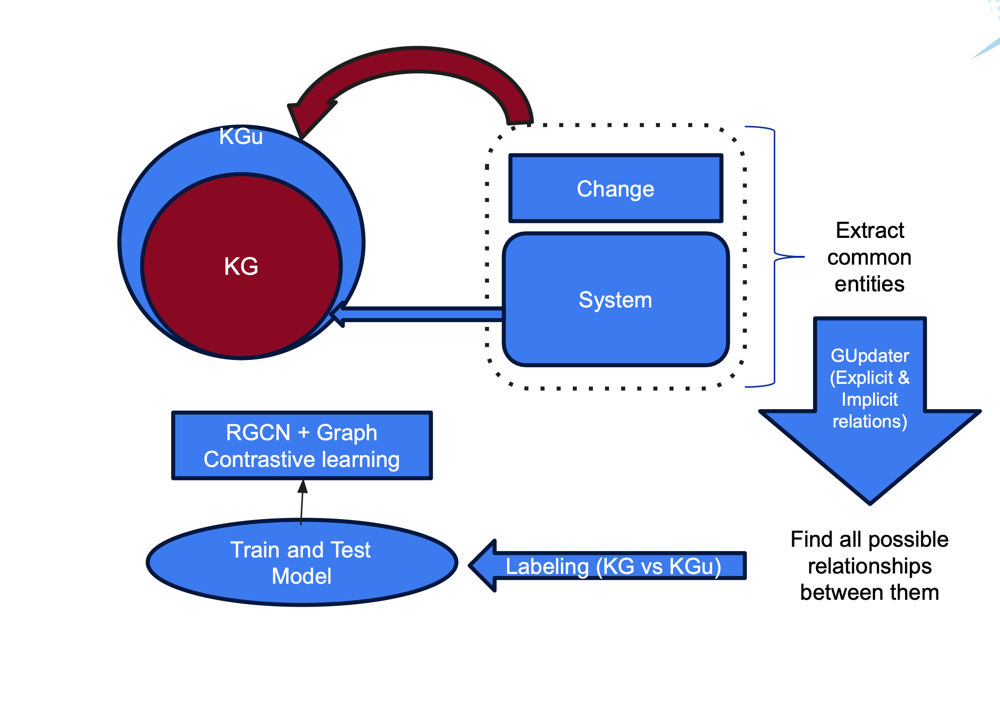
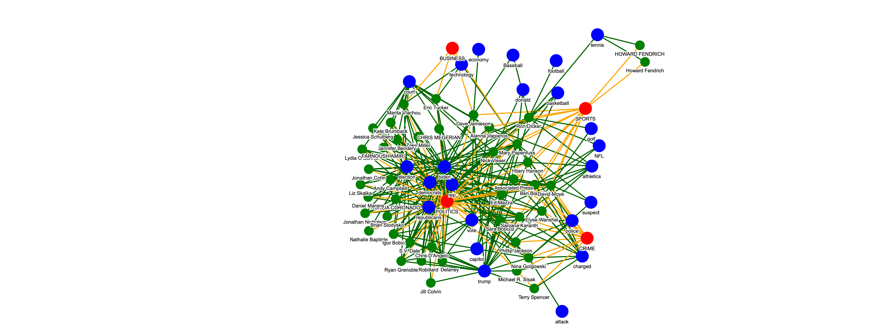

# Knowledge-Graph-Analysis
The main goal of this project was to develop an effective and efficient solution for updating a knowledge graph. To achieve this, we simulated the process by splitting our dataset into two parts: system (representing the existing knowledge graph) and change (representing new data). This setup allowed us to evaluate our model by comparing its predictions with the ground truth.
As shown in the accompanying plot, the dataset was divided into these two parts, with the goal of predicting links in the change portion. To do this, we extracted all possible relationships for entities common between the system and change parts of the knowledge graph. Next, we labeled these relationships and used the labeled data for training and testing the model

Below is a graph representing the relationships in the knowledge graph analysis:

# 1. DataSet Notebook Overview
This notebook, located at Code/dataset.ipynb, processes and analyzes a dataset of categorized news articles and performs advanced analyses like topic modeling and knowledge graph creation.
# Dataset Source:
The original dataset is sourced from Kaggle[https://www.kaggle.com/datasets/rmisra/news-category-dataset], containing categorized news headlines.
# Dependencies:
Utilizes essential Python libraries such as pandas, json, scikit-learn and gensim for topic modeling, and networkx for knowledge graph creation.
Includes Google Colab integration for accessing files from Google Drive.
# Dataset Loading:
Converts the JSON data into a pandas DataFrame for analysis.
# Data Filtering:
Filters the dataset to include articles published between '2020-09-23' and '2022-09-23`.
# Topic Modeling:
Applies topic modeling techniques on the headline column to extract underlying themes.
Clusters similar headlines into topics to identify patterns and trends in the dataset.
# Knowledge Graph Creation:
Uses networkx to build a knowledge graph based on relationships between entities extracted from the dataset (e.g., headlines, authors, categories).
Visualizes and analyzes the structure of the graph to uncover insights.
# Output:
Produces a filtered dataset, extracted topics, and a knowledge graph for further exploration and visualization.
# 2. Model Notebook Overview
# Dependencies:
Installs and imports essential libraries like torch, torch_geometric, and related modules (RGCNConv, GCNConv).
Handles data manipulation using pandas.
# Dataset Loading:
Loads a CSV dataset (datasets/implicit_explicit_labels.csv).
Filters and processes the data to handle explicit relationships.
# Model Implementation:
Builds a graph-based model using Relational Graph Convolutional Networks (R-GCN).
Leverages PyTorch Geometric for defining layers and model architecture.
# Graph Construction:
Constructs a graph representation from the dataset, including nodes and edges with explicit relationships.
Applies graph convolution techniques to propagate and analyze relational data.
# Training Pipeline:
Implements a training loop for the model, optimizing its parameters on the provided dataset.
Evaluates model performance on tasks related to relationship classification or link prediction.
# Output:
Processes the results to provide insights into the relationships and patterns within the graph.
